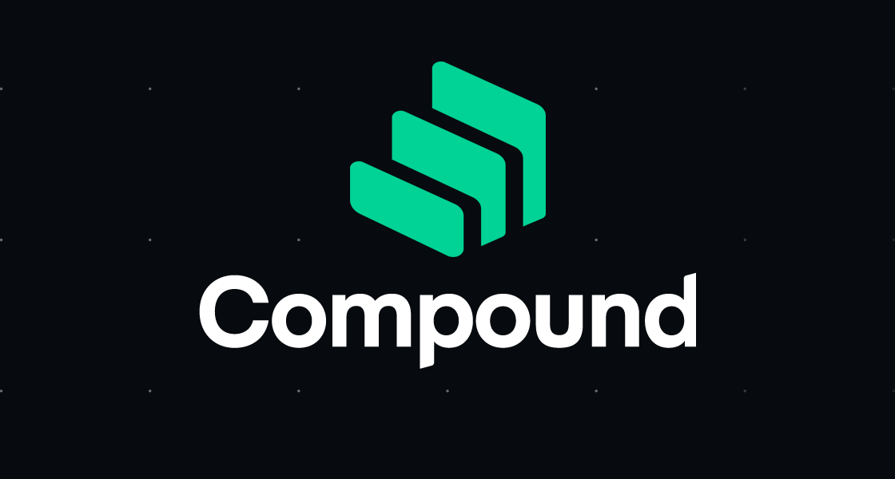
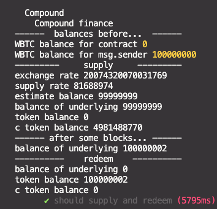
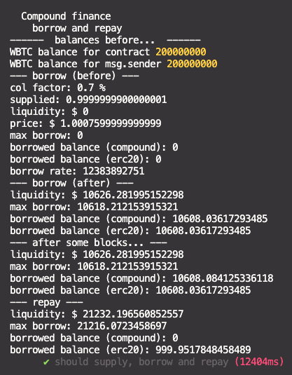

<a name="readme-top"></a>

[![Contributors][contributors-shield]][contributors-url]
[![Forks][forks-shield]][forks-url]
[![Stargazers][stars-shield]][stars-url]
[![Issues][issues-shield]][issues-url]
[![MIT License][license-shield]][license-url]
[![LinkedIn][linkedin-shield]][linkedin-url]

<!-- PROJECT LOGO -->
<br />
<div align="center">
  <a href="https://github.com/Aboudoc/Compound.git">
    
  </a>

<h3 align="center">Compound Test</h3>

  <p align="center">
    Compound
    <br />
    <a href="https://github.com/Aboudoc/Compound"><strong>Explore the docs »</strong></a>
    <br />
    <br />
    <a href="https://github.com/Aboudoc/Compound">View Demo</a>
    ·
    <a href="https://github.com/Aboudoc/Compound/issues">Report Bug</a>
    ·
    <a href="https://github.com/Aboudoc/Compound/issues">Request Feature</a>
  </p>
</div>

<!-- TABLE OF CONTENTS -->
<details>
  <summary>Table of Contents</summary>
  <ol>
    <li>
      <a href="#about-the-project">About The Project</a>
      <ul>
        <li><a href="#built-with">Built With</a></li>
      </ul>
    </li>
    <li>
      <a href="#getting-started">Getting Started</a>
      <ul>
        <li><a href="#prerequisites">Prerequisites</a></li>
        <li><a href="#installation">Installation</a></li>
      </ul>
    </li>
    <li><a href="#usage">Usage</a></li>
    <li><a href="#Supply-and-Redeem-Contract">Supply and Redeem Contract</a></li>
    <li><a href="#State-Variables">State Variables</a></li>
    <li><a href="#Constructor">Constructor</a></li>
    <li><a href="#Function-supply">Function supply</a></li>
    <li><a href="#Function-getCTokenBalance">Function getCTokenBalance</a></li>
    <li><a href="#Function-getInfo">Function getInfo</a></li>
    <li><a href="#Function-estimateBalanceOfUnderlying">Function estimateBalanceOfUnderlying</a></li>
    <li><a href="#Function-balanceOfUnderlying">Function balanceOfUnderlying</a></li>
    <li><a href="#Function-redeem">Function redeem</a></li>
    <li><a href="#Test-supply/redeem">Test supply/redeem</a></li>
    <li><a href="#Borrow-and-Repay-Contract">Borrow and Repay Contract</a></li>
    <li><a href="#Collateral">Collateral</a></li>
    <li><a href="#Account-liquidity">Account liquidity</a></li>
    <li><a href="#Open-price-feed">Open price feed</a></li>
    <li><a href="#Enter-market-and-borrow">Enter market and borrow</a></li>
    <li><a href="#Borrowed-balance-(includes-interest)">Borrowed balance (includes interest)</a></li>
    <li><a href="#Borrow-rate">Borrow rate</a></li>
    <li><a href="#Repay-borrow">Repay borrow</a></li>
    <li><a href="#Test-borrow/repay">Test borrow/repay</a></li>
    <li><a href="#Liquidate-Contract">Liquidate Contract</a></li>
    <li><a href="#Close-factor">Close factor</a></li>
    <li><a href="#Liquidation-incentive">Liquidation incentive</a></li>
    <li><a href="#Liquidate">Liquidate</a></li>
    <li><a href="#Forking-mainnet">Forking mainnet</a></li>
    <li><a href="#Note">Note</a></li>
    <li><a href="#roadmap">Roadmap</a></li>
    <li><a href="#contributing">Contributing</a></li>
    <li><a href="#license">License</a></li>
    <li><a href="#contact">Contact</a></li>
    <li><a href="#acknowledgments">Acknowledgments</a></li>
  </ol>
</details>

<!-- ABOUT THE PROJECT Uniswap V3 - Liquidity of a single position -->

## About The Project

Compound finance allows you to lend and borrow tokens

<p align="right">(<a href="#readme-top">back to top</a>)</p>

### Built With

- [![Hardhat][Hardhat]][Hardhat-url]
- [![Ethers][Ethers.js]][Ethers-url]

<p align="right">(<a href="#readme-top">back to top</a>)</p>

<!-- GETTING STARTED -->

## Getting Started

To get a local copy up and running follow these simple example steps.

### Prerequisites

- npm

  ```sh
  npm init -y
  ```

- hardhat

  ```sh
  npm install --save-dev hardhat
  ```

  run:

  ```sh
  npx hardhat
  ```

  verify:

  ```sh
  npx hardhat verify --network goerli "contract address" "pair address"
  ```

### Installation

1. Clone the repo

   ```sh
   git clone https://github.com/Aboudoc/Compound.git
   ```

2. Install NPM packages

   ```sh
   npm install
   ```

3. Dev Dependencies

   ```sh
   npm add --save-dev dotenv
   ```

<p align="right">(<a href="#readme-top">back to top</a>)</p>

<!-- USAGE EXAMPLES -->

## Usage

If you need testnet funds, use the [Alchemy testnet faucet](https://goerlifaucet.com/).

**This project shows how to interact with Compound protocol**

You can find a deep overview of `Uniswap v3` in [this repo](https://github.com/Aboudoc/Uniswap-v3)

You can learn more about `CPAMM` in [this repo](https://github.com/Aboudoc/Constant-Product-AMM)

<p align="right">(<a href="#readme-top">back to top</a>)</p>

## Supply and Redeem Contract

There are `4 operations` related to lending and borrowing on Compound:

- Supply
- Borrow
- Repay
- Redeem

First let's see how to `lend` a token to Compound and earn interests

We will start with `Supply` and `Redeem`

Let's see how to supply our token to earn interests. Once we'll want to withdraw our token, then we'll be calling redeem.

<p align="right">(<a href="#readme-top">back to top</a>)</p>

## State Variables

Declare the two token interfaces

<p align="right">(<a href="#readme-top">back to top</a>)</p>

## Constructor

Set the contract interfaces

<p align="right">(<a href="#readme-top">back to top</a>)</p>

## Function supply

When we call this function, it will lend our token to the compound protocol

1. Transfer the token from the caller inside this contract
2. Approve the `cToken` to spend the token we transfered before from `msg.sender`
3. Call `mint()` on `cToken` contract to lend the token to compound
4. When `mint()` is called, it returns a number (!0 = there is an error). Check that 0 is returned

The question is: How much `cToken` do we have?

<p align="right">(<a href="#readme-top">back to top</a>)</p>

## Function getCTokenBalance

Call `balanceOf` on `cToken`

<p align="right">(<a href="#readme-top">back to top</a>)</p>

## Function getInfo

1. if you want to know the **exchange rate** from cToken to the token that we supply, then we can call the function `exchangeRate()`on `cToken`
2. if you want to know the **interest rate** on supplying the token, then you can get it by calling `supplyRatePerBllock()` on `cToken`
   Note that these two functions are not `view` functions, this means we need to send a transaction (paying transaction fee) to get these data
   However we can get these numbers without snding a transaction, by making a `static call` to these functions

Now we can estimate the balance of the token that we supply

<p align="right">(<a href="#readme-top">back to top</a>)</p>

## Function estimateBalanceOfUnderlying

1. Return balance of underlying token using balance of `cToken` and `exchangeRate`

You must take into consideration decimals (wbtc = 8 decimals)

**We actually don't have to write this function because compound provides the same function called `balanceOfUnderlying`**

<p align="right">(<a href="#readme-top">back to top</a>)</p>

## Function balanceOfUnderlying

Calculates and returns the amount of token that we supplied into compound.

We'll see that these two function returns numbers really close to each other

<p align="right">(<a href="#readme-top">back to top</a>)</p>

## Function redeem

To claim the token and the interest

1. Check that the function call was successfull by calling `redeem()` on `cToken` (!0 = there is an error)

<p align="right">(<a href="#readme-top">back to top</a>)</p>

## Test supply/redeem

<div>

</div>

### supply

- `balance of underlying`: We supplied 1 WBTC and the balance is 0.99999 WBTC according to compound

### after some blocks

- `balance of underlying`: The balance icreased, we gain some interest for lending our WBTC

### redeem

- `token balance`: We claim the WBTC including the interest rate that we earned

<p align="right">(<a href="#readme-top">back to top</a>)</p>

## Borrow and Repay Contract

Topics related to this part of the contract:

- collateral
- account liquidity - calculate how much can I borrow?
- open price feed - USD price of token to borrow
- enter market and borrow
- borrowed balance (includes interest)
- borrow rate
- repay borrow

Start by initializing 2 compound contracts: `comptroller` and `priceFeed`

<p align="right">(<a href="#readme-top">back to top</a>)</p>

## Collateral

After you supply a token to compound, you are able to borrow a percentage of what you supply: `collateral factor` (for exemple 70%)

### Function getCollateralFactor

To get the collateral factor using smart contracts, we need to call `markets()` on the `comptroller` passing in the address of the cToken that we supply.

It will return 3 outputs: `isListed`, `colFactor` and `isComped`

**Note that the `colFactor` is scaled to 10\*\*18 => divide it by 1e18 to get in %**

<p align="right">(<a href="#readme-top">back to top</a>)</p>

## Account liquidity

How much can I borrow?

### Function getAccountLiquidity

To get the current liquidity of an account, we need to call `getAccountLiquidity()` on the `comptroller` passing in the address of this contract

It will return 3 outputs: `error`, `_liquidity` and `_shortfall`

**Note that `_liquidity`: USD amount that we can borrow up to, is scaled up by 10\*\*18**

**If `_shortfall` > 0 => subject to liquidation**

In Summary:

- normal circumstance - liquidity > 0 and shortfall == 0
- liquidity > 0 means account can borrow up to `liquidity`
- shortfall > 0 is subject to liquidation, you borrowed over the limit

<p align="right">(<a href="#readme-top">back to top</a>)</p>

## Open price feed

Why might we need the price in terms of USD?

Because liquidity is in terms of USD, by dividing it by the price of token that we want to borrow, we get the amount of tokens that we can borrow.

### Function getPriceFeed

We can get the price of the token that we borrow in terms of USD by calling `getunderlyingPrice` on the contract `priceFeed`

<p align="right">(<a href="#readme-top">back to top</a>)</p>

## Enter market and borrow

What to do to borrow the token:

1. Enter market
2. Check liquidity
3. Calculate max borrow
4. Borrow 50% of max borrow

### Function borrow

1. Call `enterMarkets()` on `comptroller` passing in the tokens that we **_supply_**. One cToken here, so we initialize an array with 1 element.

- Check `errors[0]`

2. Call `getAccountLiquidity()` on `comptroller` passing in **_this address_**.

- Check `error`, `shortfall` and `liquidity`

3. Get the price by calling `getUnderlyingPrice()` on `priceFeed` passing in the tokens that we **_borrow_**

- Calculate `maxBorrow` by divinding the liquidity by the price. Scale up liquidity by `_decimals`
- Check `maxBorrow`

4. Define `amount` as 50% of `maxBorrow`

5. Finally call `borrow()` on the `CErc20` for the `_cTokenBorrow`, and check while calling the function (0 <=> no error)

<p align="right">(<a href="#readme-top">back to top</a>)</p>

## Borrowed balance (includes interest)

Once we borrow we can get the balance of the borrowed token **_including the interest_**

### Function getBorrowedBalance

- Call `borrowBalanceCurrent()` on the cToken that we borrowed, passing in this address

**Note that this function is not a view function**

<p align="right">(<a href="#readme-top">back to top</a>)</p>

## Borrow rate

Can be interesting to get the borrow rate per block

### Function getBorrowRatePerBlock

- Call `borrowRatePerBlock()` on the `CErc20` for the cToken that we borrowed

<p align="right">(<a href="#readme-top">back to top</a>)</p>

## Repay borrow

Once we are ready to repay what we've borrowed, we will call the function `repay()`

### Function repay

- Approve the cToken that we borrowed to be able to spend the token that we borrowed for the `_amount`
- Call `repayBorrow` on CErc20 token at the address of `_ctTokenBorrowed` passing in the `_amount` we wish to repay

<p align="right">(<a href="#readme-top">back to top</a>)</p>

## Test borrow/repay

<div>

</div>

### borrow (before)

- `col factor`: The collateral factor is 70%
- `supplied`: The amount of amount of WBTC that we supply according to compound is 0.99
- `liquidity`: The amount of token that we can borrow in terms of USD is $0 => because we've not entered a market yet
- `price`: Price of token we're going to borrow => DAI
- `max borrow`: Amount of token of DAI that we can borrow is 0
- `borrowed balance (compound)`: Amount of DAI that we borrowed is 0

### borrow (after)

- `borrowed balalance (erc20)`: After we borrow, the borrowed balance is 10608.03
- `max borrow`: We can further borrow 10618 DAI
- `liquidity`: The liquidity in terms of USD is 10626 at this moment

### after some blocks

- `borrowed balance (compound)`: This shows us that the interest rate on borrow is accruing, it incresed

### repay

- `borrowed balance (compound)`: Is 0
- `liquidity`: The amount of token that we can borrow increased

<p align="right">(<a href="#readme-top">back to top</a>)</p>

## Liquidate Contract

Liquidate contract

- supply
- borrow max
- wait few blocks and let borrowed balance > supplied balance \* col factor
- liquidate

Liquidator contract

- close factor
- liqidation incentive
- liquidate

<p align="right">(<a href="#readme-top">back to top</a>)</p>

## Close factor

the maximum pourcentage of the borrow token that can be repaid

For example an account has borrowed 100 DAI and is subject to liquidation

A close factor of 50% means that we can repay up to 50% of the 100 DAI that was borrowed

<p align="right">(<a href="#readme-top">back to top</a>)</p>

### Function getCloseFactor

Call `closeFactorMantissa()` on the `comptroller`. Divide it buy 10\*\*18 to get it in percentage

<p align="right">(<a href="#readme-top">back to top</a>)</p>

## Liquidation incentive

When we call liquidate, we pay a portion of the token that was borrowed by another account

In return we are rewarded for portion of the token that was supplied as collateral, and we will receive the collateral at a discount

<p align="right">(<a href="#readme-top">back to top</a>)</p>

### Function getLiquidationIncentive

Call `liquidationIncentiveMantissa()` on the `comptroller`

<p align="right">(<a href="#readme-top">back to top</a>)</p>

### Function getAmountToBeLiquidated

Call `liquidationCalculateSeizeTokens()` on the `comptroller`

This will return `error` and `cTokenCollateralAmount` that will be liquidated

Multiply `cTokenCollateralAmount` by the exchange rate of the collateral cToken, and you will be able to get the amount of collateral that will be liquidated

`seizeAmount` = actualRepayAmount \* liquidationIncentive \* priceBorrowed / priceCollateral

`seizeTokens` = seizeAmount / exchangeRate

              = actualRepayAmount \* (liquidationIncentive \* priceBorrowed) / (priceCollateral \* exchangeRate)

<p align="right">(<a href="#readme-top">back to top</a>)</p>

## Liquidate

<p align="right">(<a href="#readme-top">back to top</a>)</p>

### Function liquidate

- Transfer the `tokenBorrow` from `msg.sender` to this contract for `_repayAmount`
- Approve the `cTokenBorrow` to be able to spend `_repayAmount` from this contract
- Finally we cal `liquidateBorrow` on `cTokenBorrow` contract passing in the address of the `_borrower` (undercollaterize), `_cTokeenCollateral` and the `repayAmount`. Check that the call is successful (returns 0)

<p align="right">(<a href="#readme-top">back to top</a>)</p>

## Forking mainnet

`hardhat.config.js`

```sh
  networks: {
        hardhat: {
          forking: {
            url: `https://eth-mainnet.alchemyapi.io/v2/${process.env.ALCHEMY_API_KEY}`,
       },
     },
  }
```

Note: Replace the `${}` component of the URL with your personal [Alchemy](https://www.alchemy.com/) API key.

```sh
npx hardhat test test/compoundErc20.test.js
```

<p align="right">(<a href="#readme-top">back to top</a>)</p>

## Note

### Further reading

You can find a Quick Start guide below

[Supplying Assets to the Compound Protocol](https://medium.com/compound-finance/supplying-assets-to-the-compound-protocol-ec2cf5df5aa)

[Borrowing Assets from the Compound Protocol](https://medium.com/compound-finance/borrowing-assets-from-compound-quick-start-guide-f5e69af4b8f4)

You can find official Compound documentation below:

[Compound Docs](https://compound.finance/docs)

[Exchange Rate](https://docs.compound.finance/v2/ctokens/#exchange-rate)

[Compound Supply examples](https://github.com/compound-developers/compound-supply-examples)

[Compound Borrow examples](https://github.com/compound-developers/compound-borrow-examples)

### Sources

[Smart Contract Engineer](https://www.smartcontract.engineer/)

[Compound Developers](https://github.com/compound-developers)

<p align="right">(<a href="#readme-top">back to top</a>)</p>

<!-- ROADMAP -->

## Roadmap

- [ ] Main functionalities of the protocol
- [ ] Test on mainnet fork
- [ ] Deploy on mainnet?
- [ ] Further reading

See the [open issues](https://github.com/Aboudoc/Compound.git/issues) for a full list of proposed features (and known issues).

<p align="right">(<a href="#readme-top">back to top</a>)</p>

<!-- CONTRIBUTING -->

## Contributing

Contributions are what make the open source community such an amazing place to learn, inspire, and create. Any contributions you make are **greatly appreciated**.

If you have a suggestion that would make this better, please fork the repo and create a pull request. You can also simply open an issue with the tag "enhancement".
Don't forget to give the project a star! Thanks again!

1. Fork the Project
2. Create your Feature Branch (`git checkout -b feature/AmazingFeature`)
3. Commit your Changes (`git commit -m 'Add some AmazingFeature'`)
4. Push to the Branch (`git push origin feature/AmazingFeature`)
5. Open a Pull Request

<p align="right">(<a href="#readme-top">back to top</a>)</p>

<!-- LICENSE -->

## License

Distributed under the MIT License. See `LICENSE.txt` for more information.

<p align="right">(<a href="#readme-top">back to top</a>)</p>

<!-- CONTACT -->

## Contact

Reda Aboutika - [@twitter](https://twitter.com/AboutikaR) - reda.aboutika@gmail.com

Project Link: [https://github.com/Aboudoc/Compound.git](https://github.com/Aboudoc/Compound.git)

<p align="right">(<a href="#readme-top">back to top</a>)</p>

<!-- ACKNOWLEDGMENTS -->

## Acknowledgments

- [Smart Contract Engineer](https://www.smartcontract.engineer/)

<p align="right">(<a href="#readme-top">back to top</a>)</p>

<!-- MARKDOWN LINKS & IMAGES -->
<!-- https://www.markdownguide.org/basic-syntax/#reference-style-links -->

[contributors-shield]: https://img.shields.io/github/contributors/Aboudoc/Compound.svg?style=for-the-badge
[contributors-url]: https://github.com/Aboudoc/Compound/graphs/contributors
[forks-shield]: https://img.shields.io/github/forks/Aboudoc/Compound.svg?style=for-the-badge
[forks-url]: https://github.com/Aboudoc/Compound/network/members
[stars-shield]: https://img.shields.io/github/stars/Aboudoc/Compound.svg?style=for-the-badge
[stars-url]: https://github.com/Aboudoc/Compound/stargazers
[issues-shield]: https://img.shields.io/github/issues/Aboudoc/Compound.svg?style=for-the-badge
[issues-url]: https://github.com/Aboudoc/Compound/issues
[license-shield]: https://img.shields.io/github/license/Aboudoc/Compound.svg?style=for-the-badge
[license-url]: https://github.com/Aboudoc/Compound/blob/master/LICENSE.txt
[linkedin-shield]: https://img.shields.io/badge/-LinkedIn-black.svg?style=for-the-badge&logo=linkedin&colorB=555
[linkedin-url]: https://www.linkedin.com/in/r%C3%A9da-aboutika-34305453/?originalSubdomain=fr
[product-screenshot]: https://ethereum.org/static/28214bb68eb5445dcb063a72535bc90c/9019e/hero.webp
[Hardhat]: https://img.shields.io/badge/Hardhat-20232A?style=for-the-badge&logo=hardhat&logoColor=61DAFB
[Hardhat-url]: https://hardhat.org/
[Ethers.js]: https://img.shields.io/badge/ethers.js-000000?style=for-the-badge&logo=ethersdotjs&logoColor=white
[Ethers-url]: https://docs.ethers.org/v5/
[Vue.js]: https://img.shields.io/badge/Vue.js-35495E?style=for-the-badge&logo=vuedotjs&logoColor=4FC08D
[Vue-url]: https://vuejs.org/
[Angular.io]: https://img.shields.io/badge/Angular-DD0031?style=for-the-badge&logo=angular&logoColor=white
[Angular-url]: https://angular.io/
[Svelte.dev]: https://img.shields.io/badge/Svelte-4A4A55?style=for-the-badge&logo=svelte&logoColor=FF3E00
[Svelte-url]: https://svelte.dev/
[Laravel.com]: https://img.shields.io/badge/Laravel-FF2D20?style=for-the-badge&logo=laravel&logoColor=white
[Laravel-url]: https://laravel.com
[Bootstrap.com]: https://img.shields.io/badge/Bootstrap-563D7C?style=for-the-badge&logo=bootstrap&logoColor=white
[Bootstrap-url]: https://getbootstrap.com
[JQuery.com]: https://img.shields.io/badge/jQuery-0769AD?style=for-the-badge&logo=jquery&logoColor=white
[JQuery-url]: https://jquery.com
